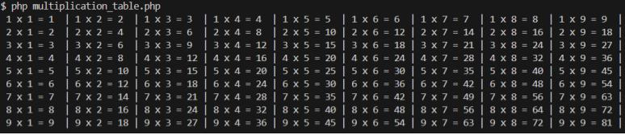
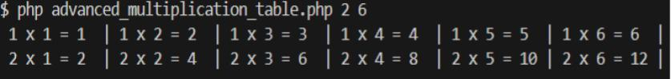
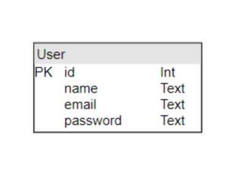
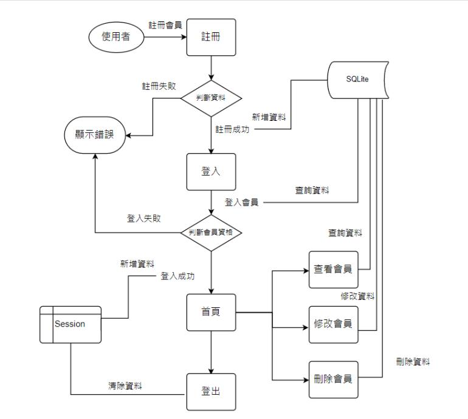

# 九九乘法表 (test1)

執行該檔案會在終端機顯示九九乘法表

  ```
  php multiplication_table.php
  ```



# 九九乘法表-進階版 (test2)

執行該檔案時加入兩個介於 1～ 9 的參數，會在終端機顯示介於參數的九九乘法表

  ```
  php advanced_multiplication_table 2 6
  ```
  

# 會員系統 (test3)

這是一個使用 PHP 和 SQLite 建立的簡單會員系統。該系統允許用戶註冊、登錄、查看和更新個人資料，並查看所有會員列表以及刪除自己的帳戶。

## 目錄

- [功能](#功能)
- [需求](#需求)
- [安裝與執行](#安裝與執行)

## 功能

- 用戶註冊
- 用戶登錄
- 查看和更新用戶個人資料
- 查看所有會員列表
- 刪除自己的帳戶
- 登出

## 需求

在使用此專案之前，請先確保在你的環境中已經有安裝以下軟體

**PHP 8.3.8**  
- 請參考 [PHP 官方網站](https://www.php.net/manual/en/install.php) 安裝 PHP。

**SQLite3**
- 請參考 [SQLite 官方網站](https://www.sqlite.org/download.html) 安裝 SQLite。


## 安裝與執行

1. 複製這個專案並進入資料夾：
  ```
  git clone https://github.com/chachagof/UM-Practice-Project.git
  cd membership-system
  ```

2. 確保 database.sqlite 文件在根目錄中。如果不存在，請在 pubic 創建它：

  ```
  touch public/database.sqlite
  ```

3. 使用本地 PHP 服務器運行應用程序：

  ```
  php -S localhost:8000 -t public
  ```

4. 打開瀏覽器並導航到 http://localhost:8000。

現在您可以開始使用這個會員系統了。註冊、登錄、查看和更新個人資料，並查看所有會員列表。

## ERD 圖



## 專案流程圖


